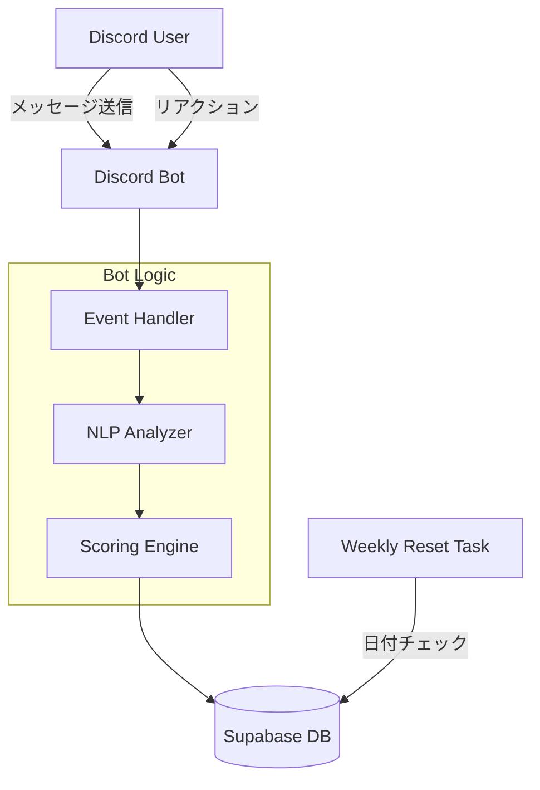

# システム設計書 (System Design & Architecture)

## 1. 概要
**Comm0ns Discord Bot** は、Discordサーバー内でのインタラクションの「質」を定量化し、可視化するためのコミュニティエンゲージメント・プラットフォームです。単にメッセージ数をカウントするだけのアクティビティ・トラッカーとは異なり、このシステムは独自の重み付けアルゴリズムを通じて貢献の *価値* を測定することを目的としています。

## 2. アーキテクチャ

### 技術スタック
-   **Runtime**: Python 3.9+
-   **Framework**: `discord.py`
-   **Database**: PostgreSQL (via **Supabase**)
-   **Hosting**: Fly.io ( Stateless Container )

### データフロー概要

## 3. コアロジック: スコアリングシステム

システムは、貢献度に基づいて全ユーザーの「品質スコア (Quality Score)」を計算します。

### 3.1. スコア構成要素
合計スコアは、以下の4つの要素の総和です：

1.  **Active Score (基本スコア)**
    -   **値**: 1メッセージにつき `3.0 ポイント`
    -   **目的**: 継続的な参加を評価します。
    
2.  **NLP Context Score** (分析スコア)
    -   **計算式**: `基本スコア * Multiplier (係数)`
    -   **係数**: NLP分析から導出（現在はプレースホルダー/パススルー）。
    
3.  **Conversation Induction Score** (会話誘発スコア)
    -   **値**: `リプライ数 * 5.0 ポイント`
    -   **目的**: 議論や会話を生み出すメッセージを高く評価します。
    
4.  **Impact Score (リアクションスコア)**
    -   **値**: 受け取ったリアクション1つにつき `1.0 ポイント`
    -   **目的**: メンバーからの評価（Crowdsourced quality validation）。
    -   *注*: 自分のメッセージへのリアクションはカウントされません。

### 3.2. 週間スコアと累計スコア
-   **Cumulative Score (累計)**: 過去の全合計。リセットされません。
-   **Weekly Score (週間)**: 毎週 **月曜日 0:00 UTC** (日本時間 月曜 09:00) にリセットされます。週間ランキングに使用されます。

## 4. データベース設計

データの整合性と複雑な集計を行うため、リレーショナルデータベースを採用しています。

### `users` テーブル
| カラム名 | 型 | 説明 |
|--------|------|-------------|
| `user_id` | BIGINT (PK) | Discord User ID |
| `current_score` | DECIMAL | 累計トータルスコア |
| `weekly_score` | DECIMAL | 現在の週のスコア |

### `messages` テーブル
| カラム名 | 型 | 説明 |
|--------|------|-------------|
| `message_id` | BIGINT (PK) | Discord Message ID |
| `user_id` | BIGINT (FK) | 投稿者 ID |
| `total_score` | DECIMAL | このメッセージの合計スコア（キャッシュ） |
| `reply_count` | INT | 受け取ったリプライ数 |
| `reaction_score` | DECIMAL | リアクションによるスコア合計 |

### `reactions` テーブル
| カラム名 | 型 | 説明 |
|--------|------|-------------|
| `message_id` | BIGINT (FK) | 対象メッセージ |
| `user_id` | BIGINT | リアクションした人 |
| `reaction_type`| VARCHAR | 絵文字名 |
| `weight` | DECIMAL | 重み (デフォルト: 1.0) |

## 5. 主要プロセス

### メッセージ処理フロー
1.  **受信**: `on_message` イベント発火。
2.  **フィルタ**: BotとDMを無視。
3.  **ユーザー同期**: `users` テーブルにユーザー情報を保存/更新 (Upsert)。
4.  **スコア計算**: 初期スコア (基本点 + NLP) を計算。
5.  **保存**: `messages` テーブルに保存。
6.  **更新**: ユーザーの `current_score` と `weekly_score` にスコアを加算。

### スコア再計算 (リアクション時)
1.  **受信**: `on_raw_reaction_add` イベント。
2.  **検証**: 自作自演でないか、重複でないかをチェック。
3.  **記録**: `reactions` テーブルに挿入。
4.  **更新**:
    -   `messages` の `reaction_score` を加算。
    -   `messages` の `total_score` を更新。
    -   投稿者の `users` テーブルのスコアを加算。

### 週間リセット (Weekly Reset)
-   **トリガー**: `check_weekly_reset` ループ (60分ごとに実行)。
-   **ロジック**: 現在の ISO週番号 が、メタデータに保存された週番号と異なるかチェック。
-   **アクション**:
    1.  `users` テーブルの全 `weekly_score` を 0 に設定。
    2.  メタデータの `last_weekly_reset_week` を更新。
    3.  設定されたチャンネルに通知を送信。

## 6. 将来の展望 (Future Vision)

### アナリティクス・プラットフォーム化
単なるランキングBotから、**「コミュニティ・ヘルス・ダッシュボード」** への進化を目指します。
-   **可視化**: 活動量の時系列グラフ。
-   **ヒートマップ**: 「どの時間帯が一番盛り上がっているか」。
-   **ネットワークグラフ**: 誰と誰がよく話しているか（コミュニティの結合度）。

### ゲーミフィケーションの拡張
-   **実績 (Achievements)**: 「初投稿」「100メッセージ達成」「バズった投稿 (10リアクション以上)」など。
-   **ロール連携**: 週間ランキング上位者に特別なロール (e.g., "Top Contributor") を自動付与。
